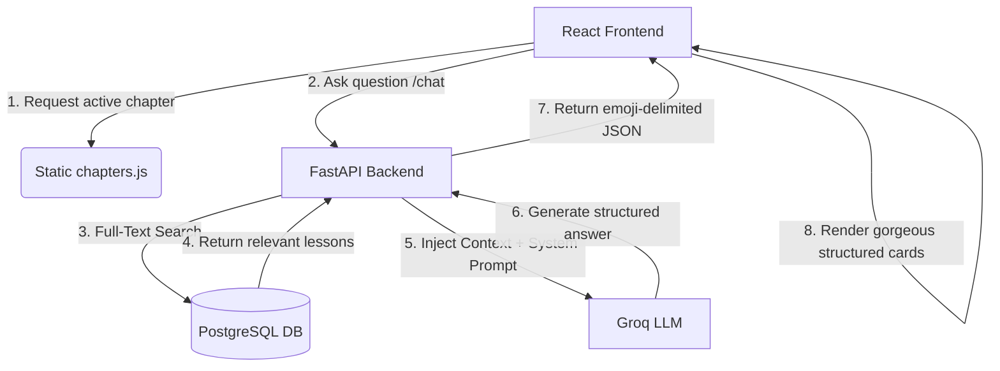

# 🌐 Universal Curriculum Migration & RAG Chatbot Blueprint

> **System Overview**: This guide is a complete, single-source-of-truth manual to help any AI Coder Agent convert **any raw curriculum JSON** (e.g., Time Series, Python coding, data science, etc.) into a highly premium, production-ready React frontend dashboard and PostgreSQL-backed RAG (Retrieval-Augmented Generation) chatbot.

---

## 📋 Table of Contents
1. [Core Architecture & Blueprint Overview](#1-core-architecture--blueprint-overview)
2. [Input JSON Data Specification](#2-input-json-data-specification)
3. [Database Schema & Migrations](#3-database-schema--migrations)
4. [FastAPI RAG Backend (`main.py` & `agent.py`)](#4-fastapi-rag-backend-mainpy--agentpy)
5. [Premium React Frontend Dashboard](#5-premium-react-frontend-dashboard)
6. [Step-by-Step AI Agent Execution Manual](#6-step-by-step-ai-agent-execution-manual)

---

## 1. Core Architecture & Blueprint Overview

The application follows a dual-stack layout:
1. **React + Vite Frontend Dashboard**: A premium, mobile-responsive dashboard displaying lessons, markdown cards, image showcase carousels, prompt cards, and task checklists. It features local-storage persistence for completed modules.
2. **FastAPI + LangChain + Groq Backend**: A Python backend that manages chat sessions and performs **local full-text database retrieval (RAG)** on PostgreSQL to fetch relevant course chapters/lessons. It feeds them directly to Groq's LLM (`llama-3.3-70b`) to answer questions with precise course material and formatted creator templates.



---

## 2. Input JSON Data Specification

To populate the curriculum, convert the raw ChatGPT session/JSON data into a standardized JavaScript module exported as `chapters.js` under `src/data/chapters.js`. 

### Standardized `chapters.js` Schema:
```javascript
export const chapters = [
  {
    id: 1, // Chapter/Lesson sequence ID
    title: "CHAPTER TITLE OR TOPIC", 
    description: "Brief summary describing the topic's objectives",
    sections: [
      {
        heading: "Section Heading", // Optional step-level heading
        content: "Plain text paragraph describing the topic", // Can also be an array: ["Point 1", "Point 2"]
        markdown: "### Markdown Title\n- Supports list items\n- Tables\n- Code blocks", // Rich textual content
        image: { // Optional primary image
          url: "https://images.unsplash.com/...", // Primary image URL (Unsplash or DALL-E)
          query: "Midjourney/DALL-E search prompt used to generate this", 
          title: "Descriptive visual caption"
        },
        carousel: [ // Optional visual gallery
          {
            url: "https://images.unsplash.com/...",
            query: "Prompt string",
            title: "Caption"
          }
        ],
        prompt: "Copyable prompt string or formula", // Optional dedicated prompt box
        bestFor: ["Audience 1", "Use Case 2"], // Optional badges
        bestContent: ["Video Type A", "Format B"] // Optional validation badges
      }
    ]
  }
];
```

---

## 3. Database Schema & Migrations

The database holds the curriculum data in a PostgreSQL schema, complete with **Full-Text Search (FTS)** indices to enable extremely fast, local vector-free RAG context retrieval.

### A. SQL Schema Definition
Run this SQL inside PostgreSQL to create the tables and search indices:
```sql
CREATE TABLE IF NOT EXISTS image_chapters (
    id              INTEGER PRIMARY KEY,
    title           TEXT NOT NULL,
    description     TEXT,
    category_tags   TEXT[],
    created_at      TIMESTAMP DEFAULT NOW()
);

CREATE TABLE IF NOT EXISTS chapter_sections (
    id                  SERIAL PRIMARY KEY,
    chapter_id          INTEGER REFERENCES image_chapters(id) ON DELETE CASCADE,
    heading             TEXT NOT NULL,
    markdown            TEXT,
    prompt              TEXT,
    best_for            TEXT[],
    best_content        TEXT[],
    sarvam_voice        TEXT,
    hook_text           TEXT,
    facebook_strategy   TEXT,
    section_order       INTEGER,
    created_at          TIMESTAMP DEFAULT NOW()
);

-- Full-Text Search Indices
CREATE INDEX IF NOT EXISTS idx_chapters_fts ON image_chapters 
    USING gin(to_tsvector('english', coalesce(title,'') || ' ' || coalesce(description,'')));

CREATE INDEX IF NOT EXISTS idx_sections_fts ON chapter_sections 
    USING gin(to_tsvector('english', coalesce(heading,'') || ' ' || coalesce(prompt,'')));
```

### B. Python Migration Seeding Engine (`migrate.py`)
This script converts `src/data/chapters.js` into valid JSON, extracts additional RAG metadata (like hook examples and strategy notes) using regular expressions, and seeds PostgreSQL.

```python
import asyncio
import asyncpg
import json
import re
import os
import sys
from pathlib import Path
from dotenv import load_dotenv

load_dotenv(Path(__file__).parent / ".env")
DATABASE_URL = os.getenv("DATABASE_URL")

def load_chapters_js() -> list:
    chapters_path = Path(__file__).parent.parent / "src" / "data" / "chapters.js"
    if not chapters_path.exists():
        print(f"Error: chapters.js not found at {chapters_path}")
        sys.exit(1)
    
    content = chapters_path.read_text(encoding="utf-8").strip()
    if content.startswith("export const chapters ="):
        content = content[len("export const chapters ="):].strip()
    if content.endswith(";"):
        content = content[:-1]
    
    return json.loads(content)

# Global mappings for specialized domains (e.g. voiceover styles, domain tags)
SARVAM_VOICE_MAP = {
    1: "Slow emotional male voice | Tone: Sad/reflective",
    2: "Happy playful voice | Tone: Warm/friendly",
    # Populate for all chapters...
}

async def migrate():
    print(f"Connecting to: {DATABASE_URL}")
    conn = await asyncpg.connect(DATABASE_URL)
    
    try:
        # Clear database for re-run idempotent updates
        await conn.execute("DELETE FROM chapter_sections")
        await conn.execute("DELETE FROM image_chapters")
        
        chapters = load_chapters_js()
        for ch in chapters:
            chapter_id = ch["id"]
            title = ch.get("title", f"Chapter {chapter_id}")
            description = ch.get("description", "")
            tags = ch.get("category_tags", [])
            
            await conn.execute("""
                INSERT INTO image_chapters (id, title, description, category_tags)
                VALUES ($1, $2, $3, $4)
            """, chapter_id, title, description, tags)
            
            for idx, sec in enumerate(ch.get("sections", [])):
                heading = sec.get("heading", "")
                markdown = sec.get("markdown", "")
                prompt = sec.get("prompt") or None
                best_for = sec.get("bestFor") or []
                best_content = sec.get("bestContent") or []
                
                # Regex prompt fallback parser
                if not prompt and markdown:
                    code_blocks = re.findall(r'```(?:text)?\s*\n(.*?)```', markdown, re.DOTALL)
                    for block in code_blocks:
                        if len(block.strip()) > 30 and "[" not in block[:20]:
                            prompt = block.strip()
                            break

                await conn.execute("""
                    INSERT INTO chapter_sections 
                        (chapter_id, heading, markdown, prompt, best_for, best_content,
                         sarvam_voice, hook_text, facebook_strategy, section_order)
                    VALUES ($1, $2, $3, $4, $5, $6, $7, $8, $9, $10)
                """,
                    chapter_id, heading, markdown, prompt, best_for, best_content,
                    SARVAM_VOICE_MAP.get(chapter_id, ""), "Sample Hook", "Strategy Info", idx
                )
        print("✅ Seeding completed successfully!")
    finally:
        await conn.close()

if __name__ == "__main__":
    asyncio.run(migrate())
```

---

## 4. FastAPI RAG Backend (`main.py` & `agent.py`)

The backend coordinates conversation history and injects semantic PostgreSQL full-text search content directly into a single system instruction to give precise, contextual answers without LLM hallucination.

### A. FastAPI Server Gateway (`backend/main.py`)
```python
import uuid
from fastapi import FastAPI, HTTPException
from fastapi.middleware.cors import CORSMiddleware
from pydantic import BaseModel
from typing import Optional
from agent import chat, clear_session

app = FastAPI(title="Curriculum Chatbot API")

app.add_middleware(
    CORSMiddleware,
    allow_origins=["*"], # In production, lock down to the React dev URL
    allow_credentials=True,
    allow_methods=["*"],
    allow_headers=["*"],
)

class ChatRequest(BaseModel):
    message: str
    session_id: Optional[str] = None

@app.post("/chat")
async def chat_endpoint(request: ChatRequest):
    if not request.message.strip():
        raise HTTPException(status_code=400, detail="Message cannot be empty")
    
    session_id = request.session_id or str(uuid.uuid4())
    reply = await chat(message=request.message.strip(), session_id=session_id)
    return {"reply": reply, "session_id": session_id}

@app.delete("/chat/{session_id}")
async def clear_chat(session_id: str):
    clear_session(session_id)
    return {"message": f"Session {session_id} cleared"}
```

### B. Python LangChain RAG Core (`backend/agent.py`)
```python
import json
import asyncio
from langchain_groq import ChatGroq
from langchain_core.messages import HumanMessage, AIMessage, SystemMessage
from database import get_pool # Custom asyncpg pool helper

_session_histories = {}

def get_or_create_history(session_id: str) -> list:
    if session_id not in _session_histories:
        _session_histories[session_id] = []
    return _session_histories[session_id]

def clear_session(session_id: str):
    if session_id in _session_histories:
        del _session_histories[session_id]

async def retrieve_context(user_message: str) -> str:
    """Uses PostgreSQL Full-Text Rank for prompt and lesson retrieval"""
    pool = await get_pool()
    async with pool.acquire() as conn:
        rows = await conn.fetch("""
            SELECT ic.id, ic.title, ic.description,
                   ts_rank(to_tsvector('english', coalesce(ic.title,'') || ' ' || coalesce(ic.description,'')), plainto_tsquery('english', $1)) as rank
            FROM image_chapters ic
            WHERE to_tsvector('english', coalesce(ic.title,'') || ' ' || coalesce(ic.description,'')) @@ plainto_tsquery('english', $1)
            ORDER BY rank DESC LIMIT 3
        """, user_message)
        
        # Fallback query if no search matches
        if not rows:
            rows = await conn.fetch("SELECT id, title, description FROM image_chapters ORDER BY id LIMIT 3")
            
        chapter_ids = [r["id"] for r in rows]
        sections = []
        if chapter_ids:
            sections = await conn.fetch("""
                SELECT ic.title as chapter, cs.heading, cs.prompt, cs.best_for, cs.sarvam_voice, cs.hook_text, cs.facebook_strategy
                FROM chapter_sections cs
                JOIN image_chapters ic ON cs.chapter_id = ic.id
                WHERE cs.chapter_id = ANY($1) AND cs.prompt IS NOT NULL
                LIMIT 10
            """, chapter_ids)
            
        context = {
            "matched_chapters": [dict(r) for r in rows],
            "sections": [dict(s) for s in sections]
        }
        return json.dumps(context)

SYSTEM_PROMPT = """You are an expert AI Masterclass Creator & Mentor.
Answer the user's questions based ONLY on the RETRIEVED DATABASE CONTEXT provided.

To deliver premium structured templates, ALWAYS format your response using this EXACT emoji card schema:

═══════════════════════════════════════════
📁 IMAGE CATEGORY
[Category name and brief description]

🎨 RECOMMENDED PROMPT
[Exact copy-ready prompt string]

🎣 FACEBOOK HOOK
[High-impact hook lines]

🗣️ SARVAM AI VOICE
→ Voice: [Arjun/Diya]
→ Tone: [dramatic/calm]
→ Pace: [slow/medium]

📱 BEST FOR
• [Use case 1]
• [Use case 2]

🚀 FACEBOOK STRATEGY
[Actionable workflow/posting strategy]

📊 VIRAL POTENTIAL: [⭐ to ⭐⭐⭐⭐⭐]
═══════════════════════════════════════════
"""

async def chat(message: str, session_id: str) -> str:
    history = get_or_create_history(session_id)
    context_json = await retrieve_context(message)
    
    llm = ChatGroq(model="llama-3.3-70b-versatile", temperature=0.6)
    
    messages = [SystemMessage(content=SYSTEM_PROMPT)]
    messages.extend(history[-10:]) # Keep last 5 turns of conversation
    
    context_payload = f"--- RETRIEVED CURRICULUM CONTEXT ---\n{context_json}\n--- END CONTEXT ---\n\nUser request: {message}"
    messages.append(HumanMessage(content=context_payload))
    
    loop = asyncio.get_event_loop()
    response = await loop.run_in_executor(None, lambda: llm.invoke(messages))
    ai_text = response.content
    
    history.append(HumanMessage(content=message))
    history.append(AIMessage(content=ai_text))
    return ai_text
```

---

## 5. Premium React Frontend Dashboard

Here are the optimized, zero-dependency visual components to achieve a premium, harmonious Warm-Amber and Deep-Slate themed responsive layout.

### A. Performant Markdown Parser (`src/components/MarkdownRenderer.jsx`)
Features a custom, high-speed pure React parser to render markdown tables, blockquotes, inline formatting, code blocks, lists, and headers without adding third-party library dependencies.

```jsx
import React from 'react';

export function MarkdownRenderer({ content }) {
  if (!content) return null;
  const blocks = content.split(/\n\s*\n/);

  return (
    <div className="space-y-4 text-slate-600 font-medium">
      {blocks.map((block, idx) => {
        const trimmed = block.trim();
        if (!trimmed) return null;

        // 1. Horizontal Rules
        if (trimmed === '---' || trimmed === '***') {
          return <hr key={idx} className="my-6 border-t border-orange-100/80" />;
        }

        // 2. Table Parser
        if (trimmed.startsWith('|') && trimmed.includes('\n|')) {
          const lines = trimmed.split('\n');
          const rows = lines.map(line => 
            line.split('|').map(c => c.trim()).filter((_, i, arr) => i > 0 && i < arr.length - 1)
          );
          const cleanRows = rows.filter(r => !r.every(c => c.startsWith('-') || c === ''));
          if (cleanRows.length === 0) return null;
          const header = cleanRows[0];
          const body = cleanRows.slice(1);

          return (
            <div key={idx} className="my-5 overflow-x-auto rounded-xl border border-orange-100 bg-orange-50/10 shadow-xs">
              <table className="w-full text-left border-collapse text-xs md:text-sm">
                <thead>
                  <tr className="border-b border-orange-100 bg-orange-500/5">
                    {header.map((cell, cIdx) => (
                      <th key={cIdx} className="px-4 py-3 font-bold text-orange-700">{renderText(cell)}</th>
                    ))}
                  </tr>
                </thead>
                <tbody className="divide-y divide-orange-100/50">
                  {body.map((row, rIdx) => (
                    <tr key={rIdx} className="hover:bg-orange-500/5 transition-colors">
                      {row.map((cell, cIdx) => (
                        <td key={cIdx} className="px-4 py-3 text-slate-700 font-medium">{renderText(cell)}</td>
                      ))}
                    </tr>
                  ))}
                </tbody>
              </table>
            </div>
          );
        }

        // 3. Blockquotes
        if (trimmed.startsWith('>')) {
          const lines = trimmed.split('\n').map(l => l.replace(/^>\s?/, ''));
          return (
            <blockquote key={idx} className="pl-4 my-4 border-l-4 border-orange-400 bg-orange-50/30 py-2.5 rounded-r-lg text-slate-600 italic">
              {lines.map((l, lIdx) => <p key={lIdx}>{renderText(l)}</p>)}
            </blockquote>
          );
        }

        // 4. Unordered Lists
        if (trimmed.startsWith('- ') || trimmed.startsWith('* ')) {
          const items = trimmed.split('\n').map(l => l.replace(/^[-*]\s?/, ''));
          return (
            <ul key={idx} className="space-y-2 my-3 pl-1">
              {items.map((item, iIdx) => (
                <li key={iIdx} className="flex items-start gap-2.5 text-sm text-slate-600 leading-relaxed font-medium">
                  <span className="mt-1.5 text-orange-500 font-bold text-xs select-none">✦</span>
                  <span>{renderText(item)}</span>
                </li>
              ))}
            </ul>
          );
        }

        // 5. Code Blocks
        if (trimmed.startsWith('```')) {
          const cleanText = trimmed.replace(/^```[a-zA-Z]*\n?/, '').replace(/\n?```$/, '');
          return (
            <pre key={idx} className="my-4 p-4 rounded-xl font-mono text-xs overflow-x-auto bg-slate-50 border border-orange-100/60 text-[#c2410c] font-semibold">
              <code>{cleanText}</code>
            </pre>
          );
        }

        // Default Paragraph
        return (
          <p key={idx} className="text-sm md:text-base text-slate-600 leading-relaxed font-medium">
            {renderText(trimmed)}
          </p>
        );
      })}
    </div>
  );
}

function renderText(text) {
  if (typeof text !== 'string') return text;
  const parts = [];
  let index = 0;
  const regex = /(\*\*.*?\*\*|`.*?`)/g; // Bold and Inline Code
  let match;

  while ((match = regex.exec(text)) !== null) {
    const matchText = match[1];
    const matchIndex = match.index;
    if (matchIndex > index) parts.push(text.substring(index, matchIndex));

    if (matchText.startsWith('**')) {
      parts.push(<strong key={matchIndex} className="font-bold text-orange-700">{matchText.slice(2, -2)}</strong>);
    } else if (matchText.startsWith('`')) {
      parts.push(<code key={matchIndex} className="px-1.5 py-0.5 rounded text-xs font-mono bg-orange-50 text-[#c2410c] border border-orange-200/50">{matchText.slice(1, -1)}</code>);
    }
    index = regex.lastIndex;
  }
  if (index < text.length) parts.push(text.substring(index));
  return parts.length > 0 ? parts : text;
}
```

### B. Image Gallery & Prompts Showcase (`src/components/ImageShowcase.jsx`)
Features a sliding Framer Motion responsive carousel, instant prompt copying, and elegant, high-impact gradient styling backups to handle dead link fallbacks elegantly.

```jsx
import React, { useState } from 'react';
import { motion, AnimatePresence } from 'framer-motion';
import { Copy, Check, ChevronLeft, ChevronRight, Image as ImageIcon } from 'lucide-react';

export function ImageShowcase({ image, carousel }) {
  const images = carousel && carousel.length > 0 ? carousel : image ? [image] : [];
  const [index, setIndex] = useState(0);
  const [copied, setCopied] = useState(false);
  const [errors, setErrors] = useState({});

  if (images.length === 0) return null;
  const activeImage = images[index];

  const handleCopy = (e, promptText) => {
    e.stopPropagation();
    navigator.clipboard.writeText(promptText);
    setCopied(true);
    setTimeout(() => setCopied(false), 2000);
  };

  const getFallbackGradient = (i) => {
    const gradients = [
      'from-amber-500 via-orange-500 to-rose-400',
      'from-orange-400 via-amber-500 to-yellow-400',
      'from-rose-400 via-peach-500 to-orange-400'
    ];
    return `bg-gradient-to-tr ${gradients[i % gradients.length]}`;
  };

  return (
    <div className="relative overflow-hidden rounded-2xl border border-orange-100 bg-white shadow-xs my-5">
      <div className="flex items-center justify-between px-4 py-2.5 border-b border-orange-100/60 bg-orange-50/20 text-xs font-semibold text-slate-500 uppercase font-mono">
        <span className="flex items-center gap-1.5"><ImageIcon className="w-3.5 h-3.5 text-orange-600" /> Visual Showcase</span>
        {images.length > 1 && <span>{index + 1} / {images.length}</span>}
      </div>

      <div className="relative aspect-video bg-slate-900 flex items-center justify-center">
        <AnimatePresence mode="wait">
          {errors[index] ? (
            <motion.div key="err" className={`w-full h-full flex flex-col items-center justify-center p-6 text-center ${getFallbackGradient(index)}`}>
              <div className="absolute inset-0 bg-black/20 backdrop-blur-xs" />
              <div className="relative z-10 space-y-1">
                <ImageIcon className="w-10 h-10 text-white/80 mx-auto animate-pulse" />
                <p className="text-white font-bold text-sm">Visual Guide Concept</p>
                <p className="text-white/85 text-xs font-mono italic px-4 line-clamp-2">"{activeImage.query}"</p>
              </div>
            </motion.div>
          ) : (
            <motion.img
              key={activeImage.url}
              src={activeImage.url}
              alt={activeImage.title}
              onError={() => setErrors(p => ({ ...p, [index]: true }))}
              initial={{ opacity: 0 }}
              animate={{ opacity: 1 }}
              exit={{ opacity: 0 }}
              className="w-full h-full object-cover select-none"
            />
          )}
        </AnimatePresence>

        {activeImage.query && (
          <button
            onClick={(e) => handleCopy(e, activeImage.query)}
            className="absolute top-4 right-4 z-10 flex items-center gap-1 px-3 py-1.5 rounded-lg text-xs font-bold bg-white/95 text-slate-700 hover:bg-orange-500 hover:text-white transition-all shadow-md cursor-pointer"
          >
            {copied ? <><Check className="w-3.5 h-3.5 text-emerald-600" /> Copied</> : <><Copy className="w-3.5 h-3.5 text-orange-500" /> Copy Prompt</>}
          </button>
        )}

        {images.length > 1 && (
          <>
            <button onClick={(e) => { e.stopPropagation(); setIndex(i => (i - 1 + images.length) % images.length) }} className="absolute left-3 w-8 h-8 rounded-full bg-white/90 flex items-center justify-center hover:bg-white text-slate-800 shadow cursor-pointer"><ChevronLeft className="w-4 h-4" /></button>
            <button onClick={(e) => { e.stopPropagation(); setIndex(i => (i + 1) % images.length) }} className="absolute right-3 w-8 h-8 rounded-full bg-white/90 flex items-center justify-center hover:bg-white text-slate-800 shadow cursor-pointer"><ChevronRight className="w-4 h-4" /></button>
          </>
        )}
      </div>

      {activeImage.query && (
        <div className="p-4 bg-slate-50 border-t border-orange-100/50">
          <p className="text-[10px] font-bold text-orange-600 uppercase tracking-widest font-mono mb-1">DALL-E / Stable Diffusion Prompt</p>
          <p className="text-xs font-mono text-slate-700 bg-white p-2 rounded border border-slate-100">{activeImage.query}</p>
        </div>
      )}
    </div>
  );
}
```

### C. Floating RAG Chatbot Drawer (`src/components/ChatBot.jsx`)
Features interactive prompt card wrappers that dynamically parse the custom emoji card scheme returned by Groq.

```jsx
import React, { useState, useRef, useEffect } from 'react';
import { motion, AnimatePresence } from 'framer-motion';
import { Sparkles, MessageCircle, Send, Trash2, X } from 'lucide-react';

const BACKEND_URL = "http://localhost:8000";

function extractBlock(text, start, end) {
  const sIdx = text.indexOf(start);
  if (sIdx === -1) return null;
  const contentStart = sIdx + start.length;
  const eIdx = end ? text.indexOf(end, contentStart) : -1;
  return (eIdx === -1 ? text.slice(contentStart) : text.slice(contentStart, eIdx)).trim();
}

function ChatMessage({ text, role }) {
  const category = extractBlock(text, "📁 IMAGE CATEGORY", "🎨");
  const prompt = extractBlock(text, "🎨 RECOMMENDED PROMPT", "🎣");
  const hook = extractBlock(text, "🎣 FACEBOOK HOOK", "🗣️");
  const voice = extractBlock(text, "🗣️ SARVAM AI VOICE", "📱");
  const bestFor = extractBlock(text, "📱 BEST FOR", "🚀");
  const strategy = extractBlock(text, "🚀 FACEBOOK STRATEGY", "📊");

  const isStructured = category || prompt || hook;

  if (role === 'user') {
    return (
      <div className="flex justify-end mb-3">
        <div className="max-w-[80%] bg-gradient-to-br from-orange-500 to-rose-500 text-white rounded-2xl rounded-tr-sm px-4 py-2.5 text-sm shadow font-medium">
          {text}
        </div>
      </div>
    );
  }

  return (
    <div className="flex items-start gap-2 mb-3">
      <div className="w-7 h-7 rounded-full bg-orange-500 text-white flex items-center justify-center shrink-0 mt-0.5 text-xs font-bold">🤖</div>
      <div className="max-w-[90%] bg-slate-800 border border-slate-700 rounded-2xl rounded-tl-sm px-4 py-3 shadow">
        {!isStructured ? (
          <p className="text-sm text-slate-200 whitespace-pre-wrap leading-relaxed">{text}</p>
        ) : (
          <div className="space-y-3.5">
            {category && (
              <div className="bg-orange-500/10 border border-orange-500/20 rounded-xl p-3">
                <span className="text-[10px] font-bold text-orange-400 tracking-wider block mb-1">📁 CATEGORY</span>
                <p className="text-sm text-white font-medium">{category}</p>
              </div>
            )}
            {prompt && (
              <div className="bg-emerald-500/10 border border-emerald-500/20 rounded-xl p-3">
                <span className="text-[10px] font-bold text-emerald-400 tracking-wider block mb-1">🎨 COPYABLE PROMPT</span>
                <p className="text-xs font-mono text-emerald-200 bg-black/40 p-2 rounded leading-relaxed select-all">{prompt}</p>
              </div>
            )}
            {hook && (
              <div className="bg-blue-500/10 border border-blue-500/20 rounded-xl p-3">
                <span className="text-[10px] font-bold text-blue-400 tracking-wider block mb-1">🎣 HIGH IMPACT HOOK</span>
                <p className="text-sm text-blue-100 italic">"{hook}"</p>
              </div>
            )}
            {voice && (
              <div className="bg-pink-500/10 border border-pink-500/20 rounded-xl p-3">
                <span className="text-[10px] font-bold text-pink-400 tracking-wider block mb-1">🗣️ VOICE SETTING</span>
                <p className="text-xs text-pink-200 whitespace-pre-line leading-relaxed">{voice}</p>
              </div>
            )}
          </div>
        )}
      </div>
    </div>
  );
}

export default function ChatBot() {
  const [isOpen, setIsOpen] = useState(false);
  const [messages, setMessages] = useState([]);
  const [input, setInput] = useState("");
  const [loading, setLoading] = useState(false);
  const [sessionId, setSessionId] = useState(null);
  
  const bottomRef = useRef(null);

  useEffect(() => { bottomRef.current?.scrollIntoView({ behavior: 'smooth' }); }, [messages, loading]);

  const send = async (msgText) => {
    if (!msgText.trim() || loading) return;
    setInput("");
    setMessages(prev => [...prev, { role: "user", text: msgText }]);
    setLoading(true);

    try {
      const res = await fetch(`${BACKEND_URL}/chat`, {
        method: "POST",
        headers: { "Content-Type": "application/json" },
        body: JSON.stringify({ message: msgText, session_id: sessionId })
      });
      const data = await res.json();
      if (!sessionId) setSessionId(data.session_id);
      setMessages(prev => [...prev, { role: "ai", text: data.reply }]);
    } catch {
      setMessages(prev => [...prev, { role: "ai", text: "❌ Connection error. Is backend server online?" }]);
    } finally {
      setLoading(false);
    }
  };

  return (
    <>
      <button onClick={() => setIsOpen(!isOpen)} className="fixed bottom-6 right-6 z-50 w-14 h-14 rounded-full bg-gradient-to-br from-orange-500 to-rose-500 shadow-lg text-white flex items-center justify-center hover:scale-105 transition-transform cursor-pointer">
        {isOpen ? <X className="w-6 h-6" /> : <MessageCircle className="w-6 h-6" />}
      </button>

      <AnimatePresence>
        {isOpen && (
          <motion.div initial={{ opacity: 0, y: 30 }} animate={{ opacity: 1, y: 0 }} exit={{ opacity: 0, y: 30 }} className="fixed bottom-24 right-6 z-50 w-[400px] h-[550px] bg-slate-900 border border-slate-800 rounded-2xl flex flex-col overflow-hidden shadow-2xl">
            <div className="p-4 border-b border-slate-800 bg-gradient-to-r from-orange-500/20 to-rose-500/20 flex justify-between items-center">
              <span className="font-bold text-white flex items-center gap-1.5"><Sparkles className="w-4 h-4 text-orange-400" /> CURRICULUM AI</span>
              <button onClick={() => setMessages([])} className="text-slate-400 hover:text-white transition-colors cursor-pointer"><Trash2 className="w-4 h-4" /></button>
            </div>

            <div className="flex-1 overflow-y-auto p-4 space-y-3">
              {messages.map((m, idx) => <ChatMessage key={idx} text={m.text} role={m.role} />)}
              {loading && <div className="text-xs text-orange-400 animate-pulse font-semibold">AI is thinking...</div>}
              <div ref={bottomRef} />
            </div>

            <div className="p-3 border-t border-slate-800 flex gap-2">
              <input value={input} onChange={e => setInput(e.target.value)} onKeyDown={e => e.key === 'Enter' && send(input)} placeholder="Ask curriculum guide..." className="flex-1 bg-slate-800 border border-slate-700 rounded-xl px-3 py-2 text-sm text-white focus:outline-none focus:border-orange-500" />
              <button onClick={() => send(input)} className="bg-orange-500 hover:bg-orange-600 text-white rounded-xl px-4 flex items-center justify-center cursor-pointer"><Send className="w-4 h-4" /></button>
            </div>
          </motion.div>
        )}
      </AnimatePresence>
    </>
  );
}
```

---

## 6. Step-by-Step AI Agent Execution Manual

When a new user JSON curriculum data file is loaded into the workspace, follow this exact workflow to complete the migration seamlessly:

### 🚀 Migration Phase Checklist
1. **Initialize Data Setup**:
   - Place the new curriculum json structure inside `src/data/chapters.js` matching the format specified in [Input JSON Data Specification](#2-input-json-data-specification).
2. **Setup Database Configuration**:
   - Boot up PostgreSQL: `sudo service postgresql start` or equivalent docker command.
   - Configure a valid connection string inside the `backend/.env` file:
     ```env
     DATABASE_URL=postgresql://<username>:<password>@localhost:5432/<dbname>
     GROQ_API_KEY=<gsk_key>
     ```
3. **Trigger Database Seeding**:
   - Install dependency requirements: `pip install -r backend/requirements.txt`
   - Run the migration script:
     ```bash
     cd backend && python migrate.py
     ```
   - Verify rows populate standard SQL indexes successfully.
4. **Boot Up Services**:
   - Run backend: `python main.py` or `uvicorn main:app --reload --port 8000`
   - Launch Vite Development server:
     ```bash
     npm install && npm run dev
     ```
5. **Verify Interface Elements**:
   - Check that chapter lists appear correctly on the left navigation sidebar.
   - Test mobile responsiveness using browser dimensions.
   - Interact with the chatbot: type a sample concept (e.g., a topic heading) to confirm RAG database context matching retrieves the correct data block.
